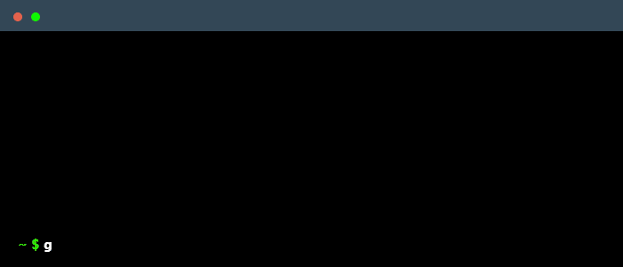

<header align="center">

# Human Mimicry - Foundation to Automation
---
</header>

<section align="center">
    <nav aria-label="Quick Links" style="text-align: center;">
      
      
      
       
      
      
      
    </nav>
  </section>

---

## 🌟 Overview

Welcome to the **Human-Mimicry Project** a technical exploration designed to bridging ethics and education in the
field of automation development. It serves purly as a research-driven tool to investigate how contemporary automation
techniques can emulate human behavior in online environments while preserving the integrity of web ecosystems.
This project highlights the importance of ethical standards, structured workflows, and compliance in modern technological endeavors.

---

### 🔑 Key Project Principles
At its core, the **Human-Mimicry Project** attempts to:
- **Transparency in Intent**: Showcasing workflows for academic and personal growth with zero commercial or unauthorized use.
- **Adherence to Platform TOS**: The project respects website directives and is designed for non-intrusive, educational purposes only.
- **Enpower The Spread of Knowledge** Serve as a resource for developers, researchers, and students committed to understanding advanced automation techniques.
- **Showcase Contemporary Advanced Techniques** Highlight the most contemporary techniques that automation developers use scrapping libraries for automating workflows.

---
> ⚠️ **Disclaimer**
This project is intended solely for educational and research purposes. It is not designed for use in violation of any platform's terms of service or for unauthorized data collection. Users are responsible for ensuring compliance with all applicable laws and regulations.
---

## 🚀 Project Highlights

### Completed Features
| 🌟 Feature                              | ✨ Description                                                                | ✅ Status  | 🗓️ Timeline |
|-----------------------------------------|------------------------------------------------------------------------------|------------|--------------|
| **Session Management**                  | Ensures continuity across multiple tasks with persistent session storage.    | &nbsp;  | January 2025 |
| **Retry with Exponential Backoff**      | Implements smart retries for failed requests while reducing detection risks. | &nbsp;  | January 2025 |
| **Request Handling with Rate Limiting** | Prevents server overload by controlling request frequency.                   | &nbsp;  | January 2025 |

---

<h2>🚀 Key and Planned Features</h2>

| 🌟 Feature                              | ✨ Description                                                                                                   | 🚀 Status                                                                                 | 🗓️ Timeline     |
|-----------------------------------------|-----------------------------------------------------------------------------------------------------------------|-------------------------------------------------------------------------------------------|------------------|
| **Dynamic User-Agent Rotation** | Mimics diverse user behaviors to avoid detection. | &nbsp;  | January 11, 2025 |
| **Stealth Browsing Enhancements**      | Implements a plethora of user behaviors, spoofing, and browser header changing. | &nbsp;  | January 11, 2025 |
| **Automated Form Filling**                  | Simulates real user input for advanced workflows. | &nbsp;  | January 11, 2025 |
| **Dynamic Content Scraping**                  | Captures data from AJAX-driven and dynamically loaded elements. | &nbsp;  | January 11, 2025 |

see more

|                                   |                                                                                                             |                                                                                                 |                  |
|-----------------------------------|-------------------------------------------------------------------------------------------------------------|-------------------------------------------------------------------------------------------------|------------------|
| **Dynamic User-Agent Rotation**   | Randomizes headers such as user-agents to mimic diverse users and avoid detection.                          | &nbsp;        | January 11, 2025 |
| **Robust Error Handling**         | Captures and logs errors for debugging while allowing graceful recovery from failures.                      | &nbsp;        | January 11, 2025 |
| **Keyword-Based Text Scraping**   | Targets specific data on web pages based on user-defined keywords, enabling precise data extraction.        | &nbsp;        | January 11, 2025 |
| **JSON Data Management**          | Formats and stores scraped data in a structured, queryable JSON format for downstream processing.           | &nbsp;        | January 11, 2025 |
| **JSON Configuration Manager**    | Enables dynamic configuration of scraping settings, stored in JSON format for reusability.                  | &nbsp;        | January 11, 2025 |
| **Data Deduplication**            | Detects and removes duplicate entries in scraped data to ensure clean and reliable results.                 | &nbsp;         | January 15, 2025 |
| **Recursive Web Crawling**        | Traverses links within websites to collect data across multiple pages while respecting crawl depth limits.  | &nbsp;  | January 15, 2025 |
| **Regex-Based Data Parsing**      | Utilizes regular expressions for extracting complex patterns or structured data from HTML.                  | &nbsp;         | January 15, 2025 |
| **Headless Browser Support**      | Integration with tools like Puppeteer or Playwright for handling JavaScript-heavy websites.                 | &nbsp;         | January 25, 2025 |
| **Stealth Browsing Enhancements** | Implements advanced anti-detection mechanisms, including screen resolution spoofing and timezone alignment. | &nbsp;         | January 25, 2025 |
| **Automated Form Filling**        | Allows automation of form submissions, mimicking real user behavior for input fields.                       | &nbsp;         | January 25, 2025 |
| **Dynamic Content Scraping**      | Captures data from dynamically loaded elements using AJAX or browser-rendering workflows.                   | &nbsp;         | January 25, 2025 |
| **Data Export Formats**           | Enables exporting data in multiple formats such as CSV, XML, or custom schemas.                             | &nbsp;         | January 25, 2025 |
| **Data Validation Rules**         | Implements checks for data integrity and ensures accurate results based on predefined rules.                | &nbsp;         | January 25, 2025 |
| **Data Backup and Restoration**   | Ensures that scraped data is safely backed up and easily restorable in case of system failures.             | &nbsp;         | January 25, 2025 |

---
## 📍 Project Roadmap

### **Q4 2024**
- 🎯 Complete Research Phase
- 🔬 Finalize Ethical Guidelines

### **Q1 2025**
- 🛠️ Develop Core Features
- 🌐 Begin Backend Integrations

### **Q2 2025**
- 🎨 UI/UX Design and Implementation
- 🧪 Initial Beta Testing

## 🗺️ Project Roadmap

| Quarter | Goal | Status    | Timeline  |
| ------- | ------ | ------ | ------ |
| Q4 2024 | 🎯 Complete Research Phase         | 🟩 Planned | November-January 2024 |
| Q1 2025 | 🔬 Finalize Ethical Guidelines     | 🟩 Planned | Febuary 2025          |
| Q2 2025 | 🛠️ Develop Core Features           | 🟩 Planned | March 2025            |
| Planned | Febuary 2025                      |
| Q2 2025 | 🌐 Begin Backend Integrations      | 🟩 Planned | March 2025            |
| Planned | Febuary 2025                      |
| Q2 2025 | 🎨 UI/UX Design and Implementation | 🟩 Planned | March 2025            |
| Planned | Febuary 2025                      |
| Q2 2025 | 🛠️ Develop Core Features           | 🟩 Planned | March 2025            |

---

## 🛠️ Getting Started

To clone and run this application, you'll need [React](https://react.dev) and [Node](https://nodejs.org/en)

Click for explanation

 
    $ git clone https://github.com/yet-it-compiles/human-mimicry

    # Navigate into the repository
    $ cd human-mimicry

    # Ensure you have the following Node version or greater installed
    node --v
    >> V18.18.0

    # Install the required dependencies
    $ npm install

    # Run the app
    $ npm run dev

---

## 💖 How to Support
Your support powers the continuous development and improvement on projects like this. Here’s how you can contribute:
- **Contribute** [Submit pull requests](https://github.com/yet-it-compiles/human-mimicry/compare) or suggest features.
- **Give it a Star**  If you find this project helpful, [star it on GitHub](https://github.com/yet-it-compiles/human-mimicry)!
- **Support Directly**
&nbsp;&nbsp;&nbsp;&nbsp;&nbsp;&nbsp;&nbsp;&nbsp;&nbsp;&nbsp;&nbsp;&nbsp;

---

## 📜 License

This project is licensed under the Human Mimicry Project License (HMPL). The license promotes ethical use and protects
the author's intent by restricting the use of the code to research purposes only. See the  file for details. **[LICENSE](./LICENSE.md)**

 [⬆ back to top](#human-mimicry-project)